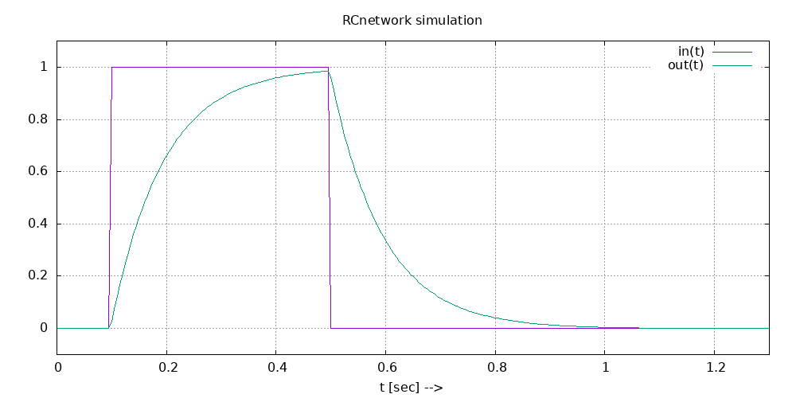

# Fuzzy Logic and Control, DySySim (Dynamical Systems Simulator)

[](https://www.codacy.com/project/josokw/Fuzzy/dashboard?utm_source=github.com&amp;utm_medium=referral&amp;utm_content=josokw/Fuzzy&amp;utm_campaign=Badge_Grade_Dashboard)
[](https://www.codefactor.io/repository/github/josokw/fuzzy)

A C++ FuzzyEngine library is implemented.

## Build management by CMake

Update CMake to the latest version (pip command must be available):

    sudo apt remove cmake

    sudo pip install cmake --upgrade

Go to the Fuzzy directory:

    cd build
    cmake ..
    make

## DySySim parser, logging and Unit testing

This project contains some unit tests for **Fuzzy** and **DySySim**.
Install the C++ [UnitTest++](https://github.com/unittest-cpp/unittest-cpp) library.

DySySim uses C++ [Boost Spirit X3](https://www.boost.org/doc/libs/develop/libs/spirit/doc/x3/html/index.html).

Install logging lib [spdlog](https://github.com/gabime/spdlog).

For creating diagrams [gnuplot](http://www.gnuplot.info) is used.

## Tipping problem

Tipping problem fuzzy rules, using the FuzzyEngine library code:

    IF service is poor OR food is rancid THEN tip is cheap
    IF service is good THEN tip is average
    IF service is excellent OR food is delicious THEN tip is generous with 0.5
    IF service is excellent AND food is delicious THEN tip is generous with 1.0

### Fuzzy sets definitions

    - TippingFIS v0.4.1 --------------------------------------------------

    Service = poor (0, 0, 2.5, 5)  input = 0  mbs = 0
    Service = good (2.5, 5, 7.5)  input = 0  mbs = 0
    Service = great (5, 7.5, 10, 10)  input = 0  mbs = 0
    Food = rancid (0, 0, 1.5, 4)  input = 0  mbs = 0
    Food = delicious (6, 8.5, 10, 10)  input = 0  mbs = 0
    Tip = cheap (0, 5, 10) mbs = 0
    Tip = average (10, 15, 20) mbs = 0
    Tip = generous (20, 25, 30) mbs = 0

### Zadeh logic

    not a = 1 - a
    a and b = min(a, b)
    a or b = max(a, b)

### Lukasiewicz logic

    not a = 1 - a
    a and b = max(a+b-1, 0)
    a or b = min(a+b, 1)

## Execute program

Current dir is *build*:

    ../bin/Tipping

Defuzzification example 1:

    -- Defuzzification: Weighted Average

    service

          10     11   11   12   16   25   25   25   25   25   25   25
           9     11   11   12   16   25   25   25   25   25   25   25
           8     11   11   12   16   25   25   25   25   25   25   25
           7     11   11   12   15   21   21   21   21   23   23   23
           6     10   10   11   13   17   17   17   19   19   19   19
           5     10   10   10   12   15   15   15   16   17   18   18
           4      8    8    9   11   11   11   11   13   15   15   15
           3      6    6    7    7    7    7    7   10   12   13   13
           2      5    5    5    5    5    5    5    8   10   11   11
           1      5    5    5    5    5    5    5    8   10   11   11
           0      5    5    5    5    5    5    5    8   10   11   11

        food      0    1    2    3    4    5    6    7    8    9   10

Defuzzification example 2 and 3:

    -- Defuzzification: Center of Sums, logic model: Zadeh

    service

          10     11   11   12   16   25   25   25   25   25   25   25
           9     11   11   12   16   25   25   25   25   25   25   25
           8     11   11   12   16   25   25   25   25   25   25   25
           7     11   11   12   15   21   21   21   21   23   23   23
           6     10   10   11   13   17   17   17   19   19   19   19
           5     10   10   10   12   15   15   15   16   17   18   18
           4      8    8    9   11   11   11   11   13   15   15   15
           3      6    6    7    7    7    7    7   10   12   13   13
           2      5    5    5    5    5    5    5    8   10   11   11
           1      5    5    5    5    5    5    5    8   10   11   11
           0      5    5    5    5    5    5    5    8   10   11   11

        food      0    1    2    3    4    5    6    7    8    9   10

    -- Defuzzification: Center of Sums, logic model: Lukasiewicz

     service

          10     11   11   12   16   25   25   25   25   25   25   25
           9     11   11   12   16   25   25   25   25   25   25   25
           8     11   11   12   16   25   25   25   25   25   25   25
           7     11   11   12   15   21   21   21   22   22   23   23
           6     10   10   11   13   17   17   17   19   19   19   19
           5     10   10   10   12   15   15   15   16   17   18   18
           4      8    8    8    9   11   11   11   13   15   15   15
           3      6    6    6    6    7    7    7   10   12   13   13
           2      5    5    5    5    5    5    5    8   10   11   11
           1      5    5    5    5    5    5    5    8   10   11   11
           0      5    5    5    5    5    5    5    8   10   11   11

        food      0    1    2    3    4    5    6    7    8    9   10

---

## DySySim

DySySim is a very basic [TUTSIM](http://tutsim.com/) look-a-like. **TUTSIM** was developed in the early 70's for script based simulation of time continuous systems represented in simulation blocks. Only a subset of the TUTSIM simulation blocks are implemented, sometimes with slightly other names.

DySySim uses the **.dss** extension for the simulation text scripts.

Fuzzy logic and control functions are not (yet) implemented in DySySim simulation blocks. Some hardcoded examples are available.

### Simulating the step response of a *RC network*

Go to the **scriptsDySySim/RCnetwork** directory.

The following DySySim script file **[RCnetwork.dss](md/RCnetwork.md)** is used.

Use the next command:

```bash
./simplot.sh
```

All simulation values are calculated. The response diagram is plotted by **gnuplot** in a .png file.



---

Further development, testing and debugging are in progress.
